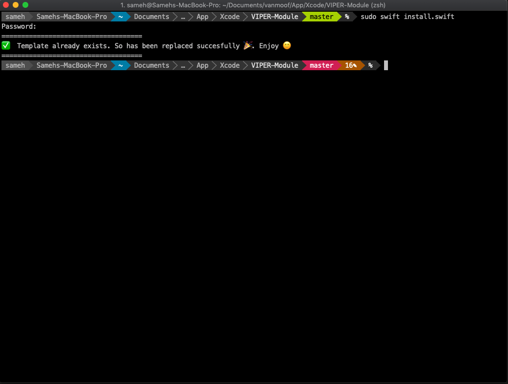

# VIPER-Module
Xcode template for VIPER Architecture 

VanMoof iOS app is built with VIPER architecture, it's time consuming to create a new module, since we need to create 5 files for each module. Imagine that you need to create 10-12 modules, assuming that each module takes 15 minutes to be created, so (10*15) you need 2,5 hours to create these 10 modules. I think it's useful to create an automated tool that does this dummy work for you. 

## How to install

### Using script (easy)
Only need execute this command in terminal:
```swift
sudo swift install.swift
```
You should be this output message:



If all it's ok you now could find your template in Xcode.


### Manual
Go to Application folder, browse to the Xcode application icon. Right-click it and choose 'Show Package Contents'. Then browse to:
`Contents/Developer/Platforms/iPhoneOS.platform/Developer/Library/Xcode/Templates/Project Templates/iOS/Application` and add "Module VIPER.xctemplate" file. Now you can find your template in Xcode.


## Easy to use


VIPER-B diagram overview


